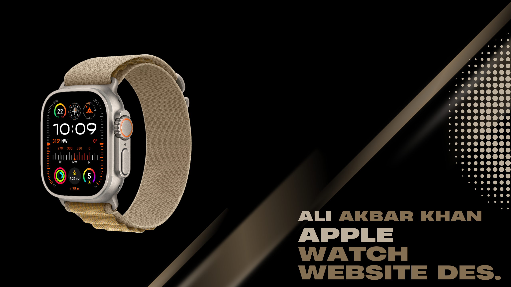

# Apple Watch Website Prototype 

## All Rights Reserved.
This repository and its contents are copyrighted. No part of this repository may be reproduced, distributed, or used without explicit permission from the owner.

## Overview 
This repository contains the Figma prototype for an **Apple Watch Website**. The design mirrors Apple’s signature minimalistic approach, offering a smooth and visually appealing shopping experience. It includes sections for product showcases, features comparison, and checkout.

## Features 
- **Product Gallery**: Showcase of the latest Apple Watch models with detailed views.
- **Interactive Product Pages**: Explore features, customization options, and specifications.
- **Responsive Layout**: Designed to work flawlessly across devices, from desktops to smartphones.
- **Elegant Design**: Minimalistic, clean, and modern—true to the Apple brand aesthetic.

## Prototype Preview 
You can view the prototype on Figma using [this link](https://www.figma.com/community/file/1334529179050076391/apple).

## Videos 

https://github.com/user-attachments/assets/2f7bd11d-fb66-4af8-b125-6588c7ec2f2c

## Files in the Repository 
- **Prototype Files** (`.fig`): Figma project file showcasing the Apple Watch website design.
- **Screenshots** (`.png`, `.jpg`): Visual representations of key sections and features.
- **Video Demos** (`.mp4`, `.gif`): Short clips demonstrating the website's flow and interactions.
- **Documentation** (`.pdf`): Detailed explanation of the design choices, user journey, and wireframes.

## How to Use 
1. Download the `.fig` file or access the Figma prototype via the link provided.
2. Use Figma to view and explore the design on desktop or mobile.

## Future Plans 
- Implement interactive elements such as model customization options in the prototype.
- Gather user feedback to enhance the UI/UX.

## License 

https://github.com/user-attachments/assets/af7a9530-cbef-4cb4-8f47-7d2a0691824d

## Contributing 
This project is not open for contributions at the moment. Suggestions and feedback are always welcome!

